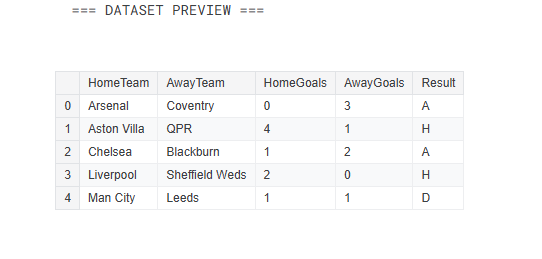
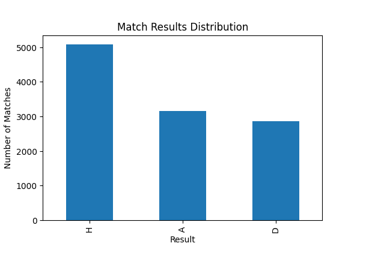
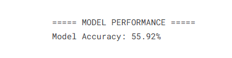

# Football Match Analysis

## Objective
Analyze football match data to understand match outcomes and patterns.

## Tools
- Python
- Pandas
- Matplotlib
- Scikit-learn

## Analysis
- Calculated win rates (home, draw, away)
- Explored match outcome distribution
- Built a simple predictive model

## Model Result
Accuracy: ~56%

## Screenshots

### Dataset & Analysis

### Results Distribution

### Model Performance

